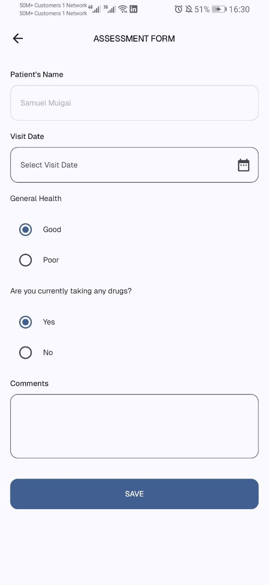

### IntelliSoft Mobile Engineer Test
An offline first app for managing patients, it allows health care providers to register patients and vital information then syncs the information to the backend.
## Screenshots
<table>
  <tr>
    <th>Login</th>
    <th>Patient listings</th>
    <th>Patient Registration</th>
  </tr>
  <tr>
    <td></td>
    <td></td>
    <td></td>
  </tr>
  <tr>
    <th>Vitals</th>
    <th>Assessment</th>
    <th>Overweight Assessment</th>
  </tr>
  <tr>
    <td></td>
    <td></td>
    <td></td>
  </tr>
</table>

## Architecture

The application follows **Clean Architecture** principles with clear separation of concerns across
three main layers, with background synchronization handled by WorkManager:

```
┌─────────────────────────────────────────────────────────────────┐
│                        PRESENTATION LAYER                       │
├─────────────────────────────────────────────────────────────────┤
│  features/                                                      │
│  ├── login/           - Login UI & ViewModel                    │
│  ├── signUp/          - Registration UI & ViewModel             │
│  ├── home/            - Patient listing UI & ViewModel          │
│  ├── patientRegistration/ - Patient reg UI & ViewModel          │
│  ├── vitals/          - Vitals capture UI & ViewModel           │
│  ├── assessment/      - Assessment UI & ViewModel               │
│  └── navigation/      - Navigation graph & screen definitions   │
│                                                                 │
│  core/ui/                                                       │
│  ├── components/      - Reusable UI components                  │
│  └── theme/          - Material 3 theming                       │
└─────────────────────────────────────────────────────────────────┘
                                   │
                                   ▼
┌─────────────────────────────────────────────────────────────────┐
│                         DOMAIN LAYER                            │
├─────────────────────────────────────────────────────────────────┤
│  domain/                                                        │
│  ├── model/          - Business entities                        │
│  │   ├── Patient.kt                                             │
│  │   ├── User.kt                                                │
│  │   ├── Vitals.kt                                              │
│  │   ├── Assessment.kt                                          │
│  │   └── Visit.kt                                               │
│  ├── repositories/   - Repository interfaces                    │
│  │   ├── AuthRepository.kt                                      │
│  │   ├── PatientRepository.kt                                   │
│  │   └── UserRepository.kt                                      │
│  └── helpers/        - Business logic helpers                   │
│      └── Result.kt                                              │
└─────────────────────────────────────────────────────────────────┘
                                   │
                                   ▼
┌─────────────────────────────────────────────────────────────────┐
│                          DATA LAYER                             │
├─────────────────────────────────────────────────────────────────┤
│  data/                                                          │
│  ├── repositories/   - Repository implementations               │
│  │   ├── AuthRepositoryImpl.kt                                  │
│  │   ├── PatientRepositoryImpl.kt                               │
│  │   └── UserRepositoryImpl.kt                                  │
│  └── mappers/        - Data transformation                      │
│      └── Mappers.kt                                             │
│                                                                 │
│  core/                                                          │
│  ├── database/       - Local storage (Room)                     │
│  │   ├── IntellisoftDatabase.kt                                 │
│  │   ├── entities/   - Database entities                        │
│  │   ├── daos/       - Data Access Objects                      │
│  │   └── Converters.kt                                          │
│  ├── networking/     - Remote data (Ktor)                       │
│  │   ├── IntellisoftApiService.kt                               │
│  │   ├── IntellisoftApiServiceImpl.kt                           │
│  │   ├── KtorClient.kt                                          │
│  │   ├── dtos/       - Data Transfer Objects                    │
│  │   └── helpers/    - Network utilities                        │
│  ├── preferences/    - Settings storage (DataStore)             │
│  │   └── AppPreferences.kt                                      │
│  └── workManager/    - Background synchronization               │
│      └── workers/    - Background sync workers                  │
│          └── SyncPatientInfoWorker.kt                           │
└─────────────────────────────────────────────────────────────────┘
                                   │
                                   ▼
┌─────────────────────────────────────────────────────────────────┐
│                    BACKGROUND SYNCHRONIZATION                   │
├─────────────────────────────────────────────────────────────────┤
│  WorkManager Integration:                                       │
│  ├── SyncPatientInfoWorker   - Patient data sync worker         │
│  ├── Network Constraints     - Sync only when connected         │
│  ├── Foreground Service      - Long-running sync operations     │
│  └── Retry Policy            - Automatic retry on failure       │
│                                                                 │
│  Features:                                                      │
│  ├── Background sync of patient information                     │
│  ├── Network-aware synchronization                              │
│  ├── Persistent notification during sync                        │
│  ├── Exponential backoff retry strategy                         │
│  └── Handles offline scenarios gracefully                       │
└─────────────────────────────────────────────────────────────────┘
```


## Libraries Used

### Data Persistence

- **DataStore Preferences**
    - Modern SharedPreferences replacement
    - Type-safe key-value storage for app settings and user preferences

- **Room Database**
    - SQLite abstraction layer for local data storage to allow fluent database access while harnessing the full power of SQLite.
 
### Background Processing

- **WorkManager**
    - Jetpack library for deferrable, guaranteed background work
    - Handles background synchronization with network constraints
    - Provides retry policies and persistent notifications

### Dependency Injection

- **Koin**
    - A pragmatic lightweight dependency injection framework for Kotlin developers, developed by Kotzilla and open-source contributors.

### UI Framework

- **Jetpack Compose**
    - Modern Android UI toolkit for building native UIs
    - Includes Material 3 design system for consistent theming
    - Provides UI components, graphics, and tooling support

### Networking

- **Ktor Client**
    - An asynchronous HTTP client, which allows you to make requests and handle responses, extend its functionality with plugins, such as JSON serialization, and more

### Serialization

- **Kotlinx Serialization**
    - Kotlin-native JSON serialization library
    - Type-safe serialization/deserialization of data classes
