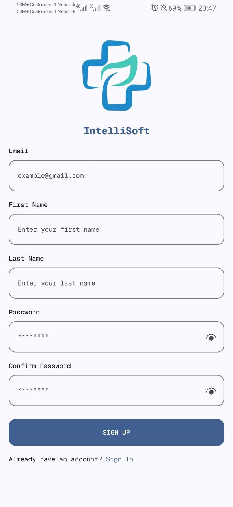
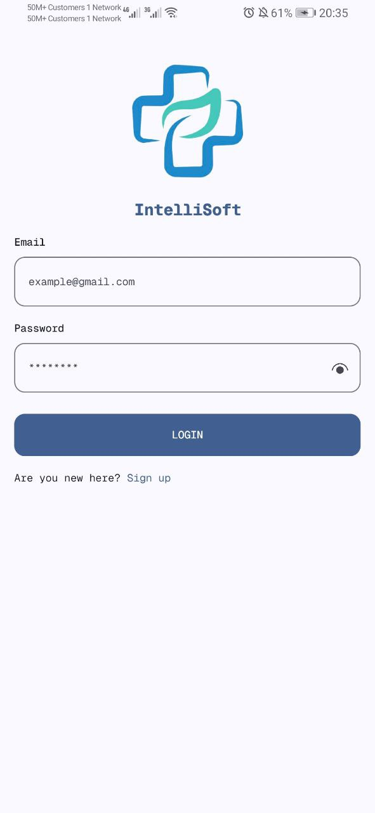
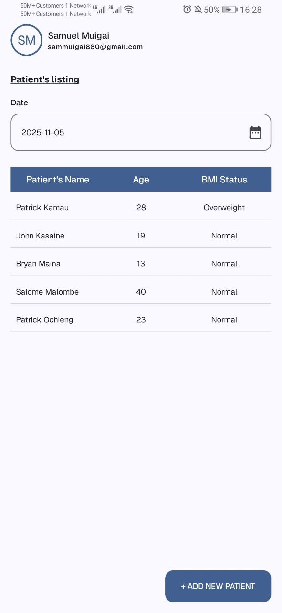
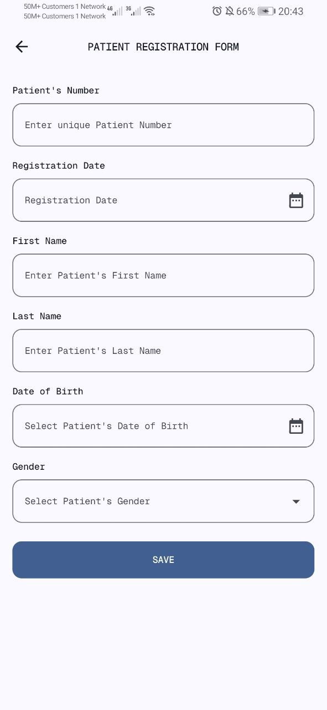
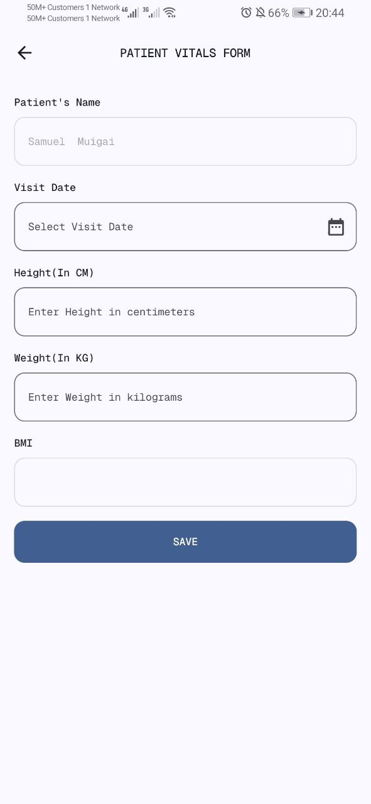
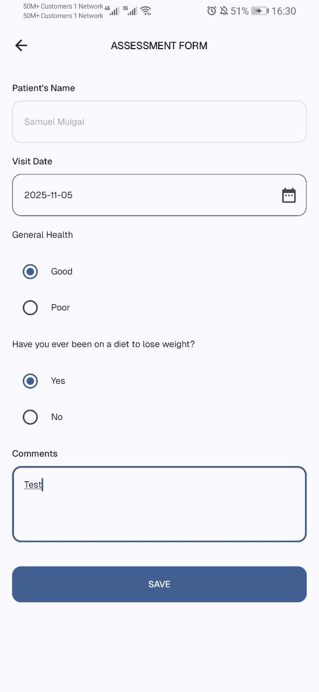

### IntelliSoft Mobile Engineer Test

## Screenshots
<table>
  <tr>
    <th>Sign Up Screen</th>
    <th>Login Screen</th>
    <th>Patient Listing Screen</th>
  </tr>
  <tr>
    <td></td>
    <td></td>
    <td></td>
  </tr>
  <tr>
    <th>Patient Registration</th>
    <th>Vitals</th>
    <th>General Assessment</th>
  </tr>
  <tr>
    <td></td>
    <td></td>
    <td></td>
  </tr>
</table>

## Libraries Used

### Data Persistence

- **DataStore Preferences**
    - Modern SharedPreferences replacement
    - Type-safe key-value storage for app settings and user preferences

- **Room Database**
    - SQLite abstraction layer for local data storage to allow fluent database access while harnessing the full power of SQLite.

### Dependency Injection

- **Koin**
    - A pragmatic lightweight dependency injection framework for Kotlin developers, developed by Kotzilla and open-source contributors.

### UI Framework

- **Jetpack Compose**
    - Modern Android UI toolkit for building native UIs
    - Includes Material 3 design system for consistent theming
    - Provides UI components, graphics, and tooling support

### Networking

- **Ktor Client**
    - An asynchronous HTTP client, which allows you to make requests and handle responses, extend its functionality with plugins, such as JSON serialization, and more

### Serialization

- **Kotlinx Serialization**
    - Kotlin-native JSON serialization library
    - Type-safe serialization/deserialization of data classes

